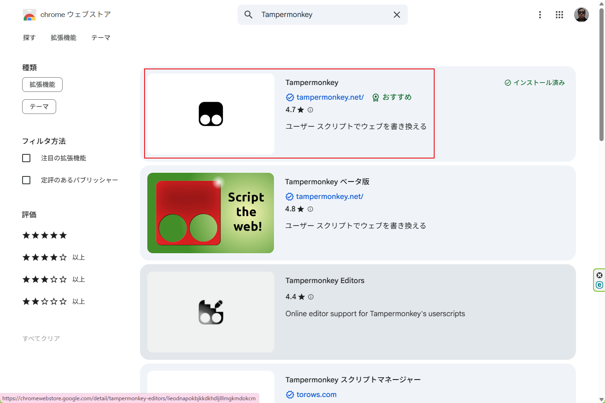
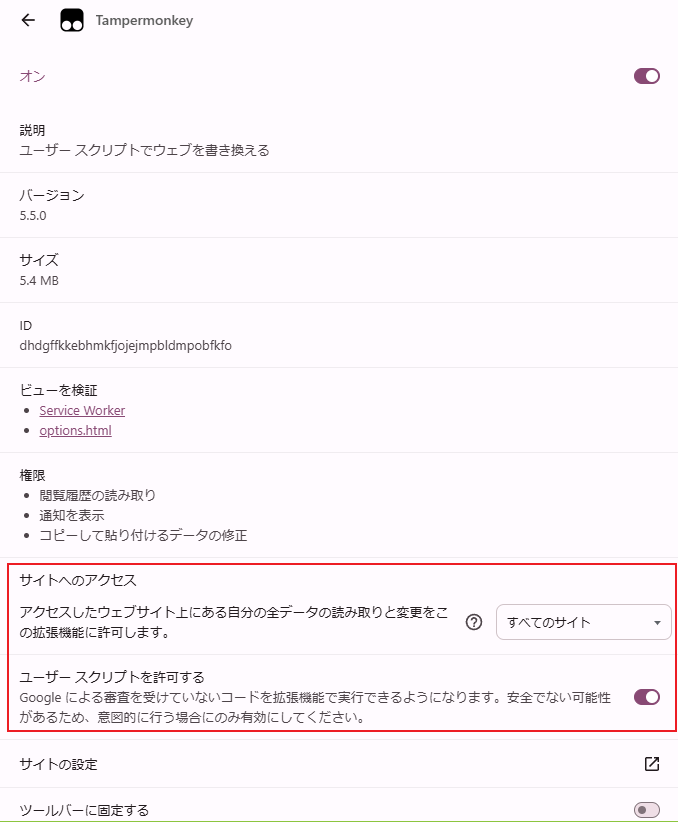
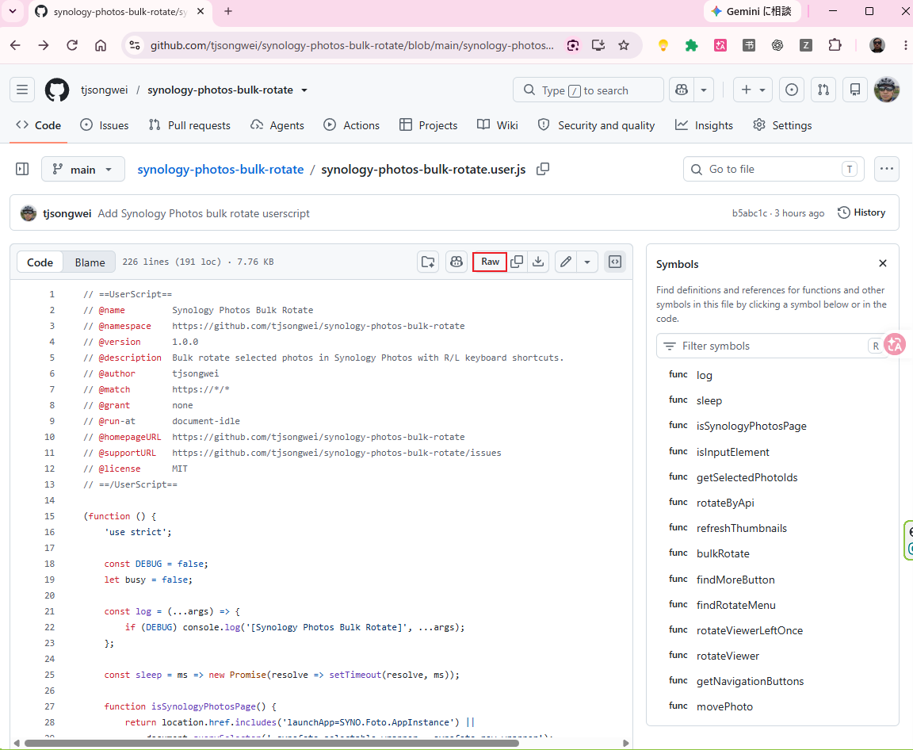
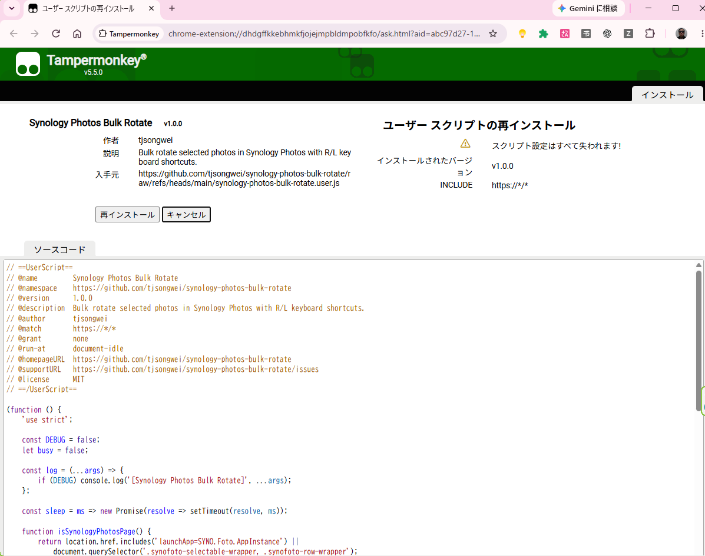
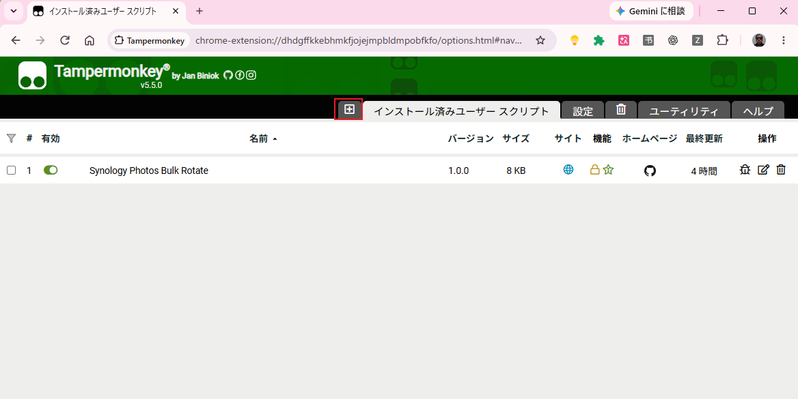
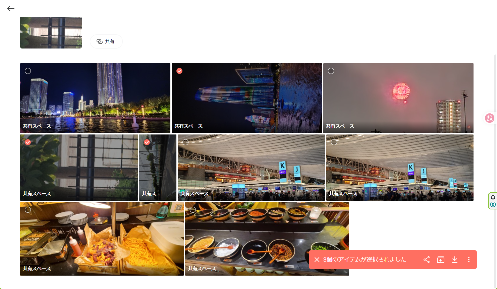
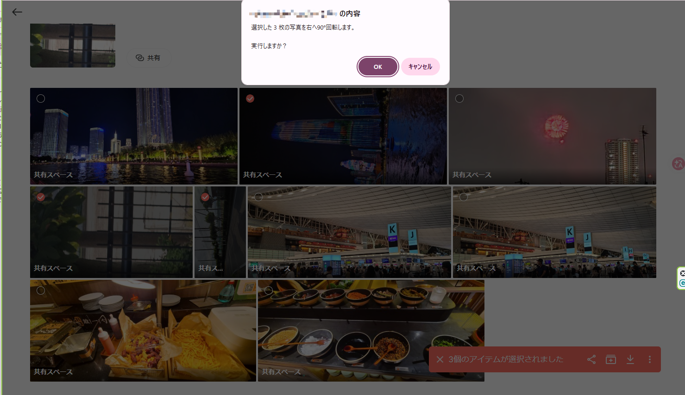
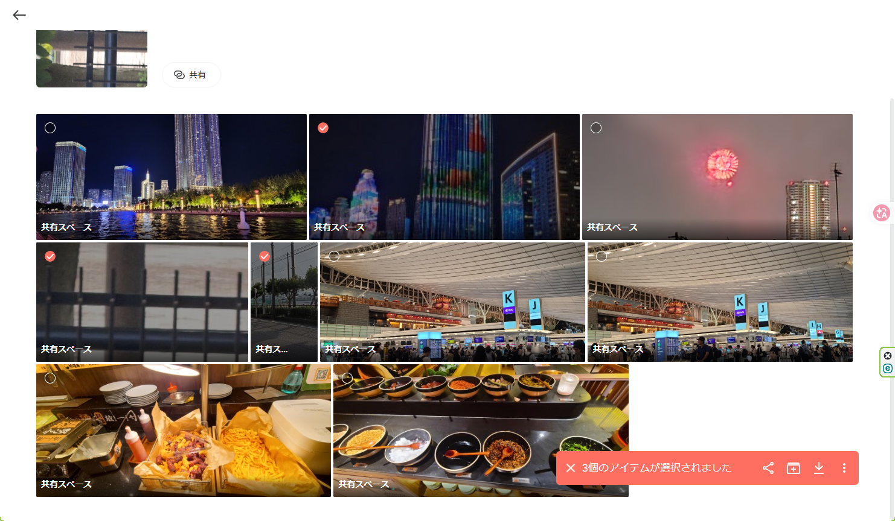

# Synology Photos Bulk Rotate

**English** | [日本語](./README.ja.md) | [简体中文](./README.zh-CN.md)

A Tampermonkey userscript that adds keyboard shortcuts and **bulk rotation** to the Synology Photos web interface.

Synology Photos does not currently provide a convenient bulk-rotate command in the photo list. This script lets you select multiple photos and rotate them together without reloading the whole page.

## Features

| Key | Photo list | Single-photo viewer |
| --- | --- | --- |
| `R` | Rotate all selected photos 90° right | Rotate current photo 90° right |
| `L` | Rotate all selected photos 90° left | Rotate current photo 90° left |
| `→` | — | Next photo |
| `←` | — | Previous photo |

For bulk rotation, the script uses the same Synology Photos web API observed in the browser interface:

- `SYNO.FotoTeam.Browse.Item`
- `method=set`
- `rotate_action="clockwise"` or `"counter_clockwise"`

After a bulk rotation, only the affected thumbnail images are refreshed. The whole Synology Photos page is **not reloaded**, so filters and the current scroll position are preserved.

## Tested environment

The initial release was tested with:

- Synology DSM 7.4.1-90080
- Synology Photos web interface
- Google Chrome
- Tampermonkey

Other DSM / Synology Photos / browser versions may also work, but have not been verified yet.

## Installation

### 1. Install Tampermonkey

Install the Tampermonkey extension for your browser from the official Tampermonkey website or your browser's extension store.



### 2. Allow user scripts

Recent Chrome/Tampermonkey versions may require permission to execute user scripts.

Open:

`Chrome → Extensions → Manage extensions → Tampermonkey → Details`

Then enable **Allow User Scripts** (wording may differ depending on Chrome/Tampermonkey version).

If the script is installed but Tampermonkey says it has not executed, check this setting first.



### 3. Install this userscript

Open:

[`synology-photos-bulk-rotate.user.js`](./synology-photos-bulk-rotate.user.js)

Click **Raw** on the file page:



Tampermonkey should then open the userscript installation screen. If the script is already installed, the button may say **Reinstall** instead of **Install**.



After installation, you can confirm that **Synology Photos Bulk Rotate** is enabled in the Tampermonkey dashboard.



> The script uses `@match https://*/*` because Synology Photos can be hosted on many different domains, IP addresses and HTTPS ports. The script immediately checks whether the current page is Synology Photos before handling keyboard input. It uses `@grant none` and does not send data to external services.
>
> If you prefer tighter permissions, edit the `@match` line after installation and replace it with your own Synology Photos address, for example:
>
> ```javascript
> // @match https://nas.example.com:5001/*
> ```

## Usage

### Bulk rotate photos

1. Open Synology Photos in your browser.
2. Select two or more photos in the timeline/list view.


3. Press:
   - `R` to rotate the selected photos 90° clockwise.
   - `L` to rotate the selected photos 90° counter-clockwise.
4. Confirm the operation.


5. The selected photos are rotated together and their thumbnails are refreshed.



The page itself is not reloaded.

### Single-photo viewer

When a photo is open in the viewer:

- `L` rotates it 90° left.
- `R` rotates it 90° right.
- `←` and `→` move between photos.

Synology Photos' viewer exposes a left-rotation action. For right rotation in the viewer, the script performs three left rotations.

## Why no page reload?

Reloading Synology Photos can be slow and may reset temporary UI state such as filters or the current position in a large timeline.

This script therefore refreshes only the thumbnail `` elements for the photos that were rotated.

## Known limitations

- Immediately after rotating a landscape photo into portrait orientation (or vice versa), the refreshed thumbnail may temporarily appear cropped because Synology Photos' existing row layout is not recalculated.
- This is only a display issue in the current list view. Reloading Synology Photos makes the thumbnail layout normal again.
- The script relies on Synology Photos' internal web API and DOM structure. A future DSM or Synology Photos update may change these interfaces and require an update to this script.
- Bulk rotation has been tested with the environment listed above; other versions are not guaranteed.

## Security / privacy

The script:

- Runs locally in your browser through Tampermonkey.
- Uses the currently authenticated Synology Photos session.
- Does not contain your Synology username, password, session token, or NAS address.
- Does not transmit photo information to an external server.

Do not publish browser cookies, `SynoToken` values, or other session credentials when reporting an issue.

## Troubleshooting

**Nothing happens when I press R or L**

Check that:

1. Tampermonkey is enabled.
2. This userscript is enabled.
3. Chrome allows Tampermonkey to run user scripts.
4. The Synology Photos tab was refreshed after installing/enabling the script.

**The photos rotate, but the thumbnail looks cropped**

This is a known temporary display limitation. The actual rotation has already been applied. Reloading Synology Photos restores the normal thumbnail layout.

**Rotation fails**

Open Chrome DevTools with `F12`, select **Console**, and look for messages beginning with:

```text
[Synology Photos Bulk Rotate]
```

When opening an issue, remove any cookies, SynoToken values, hostnames, or other private information from screenshots/logs.

## Disclaimer

This project is an independent userscript and is **not affiliated with or endorsed by Synology Inc. or Tampermonkey**.

It uses internal behavior of the Synology Photos web application, which may change without notice. Back up important photos and test the script on a small number of non-critical images before using it on a large library.

## License

MIT License. See [LICENSE](./LICENSE).

## Contributing

Bug reports and compatibility reports are welcome through GitHub Issues. When reporting a problem, please include your DSM version, Synology Photos version, browser version and Tampermonkey version, but do **not** include authentication tokens or private NAS URLs.
